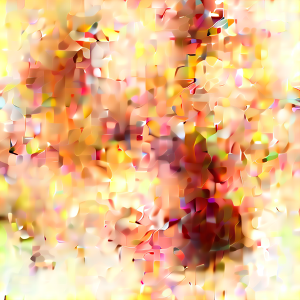
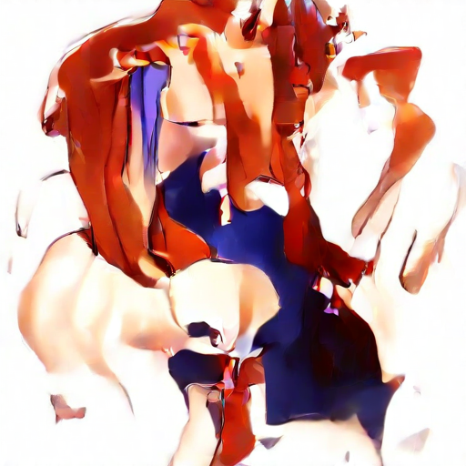
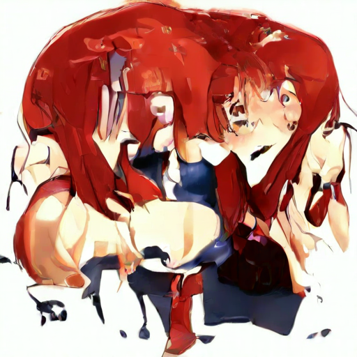
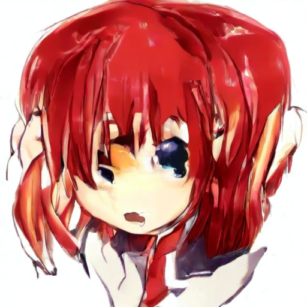
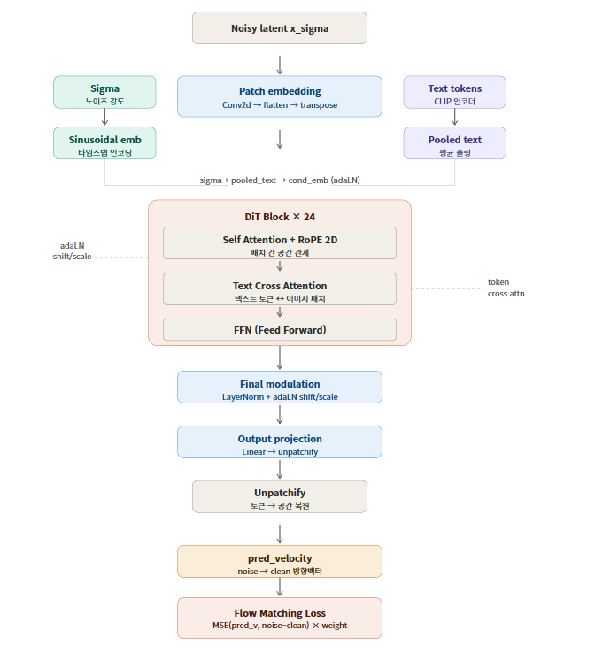

# Diffusion Transformer

A flow matching-based diffusion transformer for anime image generation.  
This project is for **research purposes only**.

## Links

- GitHub: https://github.com/FREEANIMA/diffusion_model_sampling
- Hugging Face: https://huggingface.co/honghong3/diffusion-transformer

## License

This project is licensed under [CC BY-NC 4.0](https://creativecommons.org/licenses/by-nc/4.0/).  
For research and non-commercial use only.

## Training Environment

- **GPU**: NVIDIA A100 40GB (Google Colab)
- **Dataset**: ~4.8M anime images
- **Processed**: ~1.8M images (epoch 0, ongoing)
- **Throughput**: ~1.3 it/s
- Samples below are intermediate checkpoints — quality will improve as training continues.

## Training & Samples

| 12k images | 600k images | 1.2M images | 1.8M images |
|---|---|---|---|
|  |  |  |  |

```
# sampler conditional
prompt    = "1girl, red hair, school uniform, happy, red eyes, open mouth, detailed face"
steps     = 100
cfg_scale = 2.0
seed      = 1234
```

## Model Architecture

- **Backbone**: Diffusion Transformer (DiT) with adaLN modulation
- **Parameters**: ~550M
- **Framework**: Flow Matching (velocity prediction)




## Components

| Component | Model |
|---|---|
| VAE | stabilityai/sd-vae-ft-mse |
| Text Encoder | openai/clip-vit-large-patch14 |
| Tokenizer | openai/clip-vit-large-patch14 |

## Sampler Details

- **Resolution**: 512 × 512 (single bucket)
- **Noise Schedule**: Log-SNR uniform sampling with resolution-dependent shift
- **CFG**: Classifier-free guidance
- Prompts are **tag-based** (comma-separated danbooru-style tags)

## Requirements

```bash
pip install torch transformers diffusers accelerate torchvision tqdm
```

## Usage

```bash
python main.py
```

```
C:.
│  main.py
│  output.png
│  README.md
│  requirements.txt
│
├─app
│  │  clip.py
│  │  config.json
│  │  config.py
│  │  model.py
│  │  sampling.py
│  │  sd_vae.py
│  └─ __init__.py
│
├─assets
│      100k.png
│      150k.png
│      1k.png
│      50k.png
│
└─weights
       image.pth

```